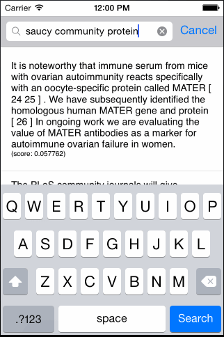

# objc-ngram

[](https://travis-ci.org/dblock/objc-ngram)
[](http://cocoadocs.org/docsets/objc-ngram)
[](http://cocoadocs.org/docsets/objc-ngram)

## Demo

To run the example project, run `pod try objc-ngram`.

The demo loads [sentences.txt](Demo/Data/sentences.txt) and lets you search for free-formed text in it.



## Installation

objc-ngram is available through [CocoaPods](http://cocoapods.org), to install it add the following line to your Podfile:

    pod "objc-ngram"

## Usage

Import `OCNDictionary`.

``` objc
#import <objc-ngram/OCNDictionary.h>
```

Create an `OCNDictionary` and add objects to it with a given key. The key must be a string and is split into 3-grams.

``` objc
OCNDictionary *dict = [OCNDictionary dictionary];
[dict addObject:@"red brown fox" forKey:@"red brown fox"];
[dict addObject:@"white big bear" forKey:@"white big bear"];
[dict addObject:@"hiding rabbit" forKey:@"hiding"];

NSArray *results = [dict matchObjectsForKey:@"white fox"];
for (OCNObjectScore *result in results) {
  NSLog(@"'%@' has a score of %f", result.object, result.score);
}
```

This will output the following.

```
'white big bear' has a score of 1.416667
'red brown fox' has a score of 0.181818
```

You can create a `OCNDictionary` with a different n-gram size.

``` objc
OCNDictionary *dict = [OCNDictionary dictionaryWithNgramWidth:4];
```

## Contributing

See [CONTRIBUTING](CONTRIBUTING.md).

## License

The objc-ngram library is available under the MIT license. See the LICENSE file for more info.

